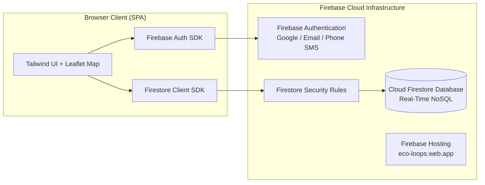

# Walkthrough - Eco Loop: Firebase Backend Migration (Auth + Firestore + Hosting)

**Eco Loop** has been successfully migrated to a serverless, cloud-native architecture powered by **Firebase Authentication**, **Cloud Firestore**, and **Firebase Hosting**.

---

## 🚀 What Was Accomplished

---

## 🔑 1. Multi-Method Firebase Authentication

The previous mock login has been replaced with a unified Firebase Authentication system supporting **three distinct sign-in methods**:

1. **🔵 Google Sign-In (1-Click Popup)**:
   - Uses `firebase.auth.GoogleAuthProvider()` with `signInWithPopup()`.
   - On first sign-in, automatically generates an official municipal citizen profile in Firestore with a unique `ECO-CTZ-xxxx` ID, 50 starter EcoCredits, and custom QR code token.
2. **✉️ Email & Password Authentication**:
   - Supports both **Account Creation (Sign Up)** and **Sign In** with password encryption.
3. **📱 Phone (SMS OTP) Authentication**:
   - Includes invisible **reCAPTCHA** integration (`firebase.auth.RecaptchaVerifier`) and 6-digit OTP verification.
4. **🎭 Demo Persona Switcher**:
   - Allows instant 1-click evaluation of all 3 roles (**Citizen**, **Collector**, **Admin**).

---

## 🗄️ 2. Cloud Firestore Real-Time Data Architecture

All SQLite tables and FastAPI REST endpoints have been replaced with client-side Firestore collections managed by [`firestore-service.js`](file:///c:/Users/Peran/OneDrive/Desktop/Eco%20Loop/app/static/js/firestore-service.js):

| Firestore Collection | Document ID | Description |
|---|---|---|
| `users` | `users/{uid}` | Citizen, Collector, and Admin profiles, EcoCredits, QR tokens, and addresses. |
| `cameras` | `cameras/{code}` | 8 Municipal CCTV cameras with GPS coordinates, live statuses, and AI detection feeds. |
| `penalties` | `penalties/{code}` | CCTV littering violations, optical evidence images, fine amounts, disputes, and payment states. |
| `collections` | `collections/{code}` | Waste scale weighings, categories, and EcoCredits credited to residents. |
| `pickup_requests` | `pickup_requests/{code}` | Real-time on-demand doorstep waste pickup calls with live status progression. |
| `rewards` | `rewards/{code}` | Municipal benefit catalog items (Tax rebates, Metro transit passes, Compost kits). |
| `redemptions` | `redemptions/{id}` | Redeemed voucher codes and active discount vouchers. |
| `tickets` | `tickets/{code}` | CCTV maintenance tickets and technician resolution logs. |
| `config/rates` | `config/rates` | Municipal waste reward rates (per kg) and statutory littering fine tariffs. |

---

## 📞 3. Real-Time On-Demand Pickup Calling System

- **Citizen View**: Residents click **"📞 Call Waste Collector Now"** to request doorstep waste weighing. A live status tracker updates via `onSnapshot`:
  `DISPATCHED 🟡` ➔ `COLLECTOR EN ROUTE 🚛` ➔ `AT DOORSTEP 📍` ➔ `COMPLETED & CREDITED ✅`
- **Collector View**: Collectors receive calls in real-time in the **Ward Dispatch Queue**, click **"Accept"**, mark **"Arrived"**, and click **"Weigh Waste"**.
- **Instant Handover & Auto-Clear**: Confirming the scale weight automatically credits the resident's EcoCredits wallet, marks the pickup request `COMPLETED`, and clears it from the collector's screen.

---

## 🛡️ 4. Firestore Security Rules

Deployed [`firestore.rules`](file:///c:/Users/Peran/OneDrive/Desktop/Eco%20Loop/firestore.rules) enforcing strict data privacy:
- Users can read/write their own profile; admins have full governance.
- CCTV camera status and maintenance tickets are secured.
- Collections and penalties have audit integrity.

---

## 🌐 5. Deployment & Live URLs

The application is deployed and live on **Firebase Hosting**:

- **Production URL**: **[https://eco-loops.web.app](https://eco-loops.web.app)**
- **Firebase Console**: **[https://console.firebase.google.com/project/eco-loops/overview](https://console.firebase.google.com/project/eco-loops/overview)**
- **Local Dev Server**: **[http://localhost:8000](http://localhost:8000)**
